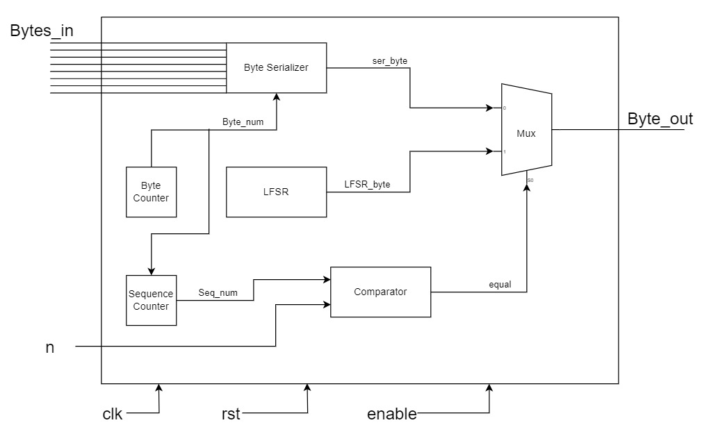

# Custom PRBS-15 Block with Pattern Detector

## Overview

In this work, a system is designed and implemented in order to generate random bytes. The system begins by generating a known sequence of 4 bytes for n times and after that the random bytes are sent. The architecture of this system is mainly composed of two main sub-modules: **PRBS** and **Pattern Detector**. Pseudorandom binary sequence (PRBS) block is a digital hardware that generates a sequence of random bits. Pattern Detector is used to check if the known sequence of 4 bytes is received without errors or not. This system can be used in telecommunications, encryption, and etc.  

## Architecture

### System Top

As mentioned before, the system contains 2 main sub-modules: PRBS and Pattern Detector. In this section, the architecture and idea of each block will be explained. The architecture of overall system is illustrated below.

    
    
System Architecture

**Signal Description:**

| Signal Name | Type | width | Description |
|-------------|------|-----|--------------|
| clk      | input  | 1 |system clock / positive edge|
| rst      | input  | 1 |system reset / active low|
| enable   | input  | 1 |system enable / active high|
| bytes_in | input  | 32 |sequence that is sent to be checked|
| pattern  | input  | 32 |sequence that have to be received|
| Byte_out | output | 8 |represents either sequence byte or random byte|
| pattern_valid |  output   | 1 |represents the received sequence  is correct|

**Function & Operation:**

In this section, the way of how the system works and operates will be covered in detail. As seen in the figure below. The pattern which consists of 4 bytes sent byte by byte in each clock cycle and the process of sending this pattern lasts for 2 times depending on the n input. After receiving the pattern twice correctly the signal pattern_valid rises to one indicating that the pattern has received correctly without any corruption. 

    
    
Case for rigth operation

In case of receiving data other than the pattern, pattern_valid signal does not rise and stays to low, therefore, the only solution for this problem is to reset the overall system to work again correctly. This event is illustarted below.

    
    
Case for wrong operation

### PRBS

The architecture of PRBS is shown in the figure below.  

    
    
PRBS architecture

- Byte Serializer: This block takes the 32-bit sequence and serializes them byte by byte depending on the number taken from the counter.

- LFSR: This block generates random byte every clock cycle. The LFSR is just a 15-bit shift register feeding its least significant bit by the Xoring of bit 13 and 14. The random byte consists of the generated least significant bit and random bits from the shift register. LFSR_byte <= {lsb,register[1:0],register[5],register[11:10],register[8],register[13]}.
- Byte_Counter: It is a counter that is used to count the number of serialized  bytes.
- Sequence_Counter: It is used to count the number of 4-bytes pattern that is serialized byte by byte.
- Comparator: It compares between the number of sequence pattern that is completely get out serially and the number of wanted repetition times.
- Mux_2X1: It chooses which byte will be get out depending on the signal of the comparator.

### Pattern Detector

The architecture of Pattern Detector is shown in the figure below.

    
    
Pattern Detector architecture

- Byte Comparator: This block compares each received byte by another byte from the input pattern based on the value of the Byte Counter and output a signal indicates if they are equal or not.

- FSM: This FSM mainly determines whether the pattern is detected correctly or not depending on some signals clarified on the diagram.
- Byte Counter and Sequence counter are like the ones used in PRBS.

### FSM State Diagram

The FSM state diagram is shown in the figure below.

    
    
FSM State Diagram

The FSM has only four states. These states describe how the FSM works. Moreover, the FSM diagram does not has a closed loop but this is the behavior of the circuit.

- START: The FSM waits until the start signal is asserted from the byte comparator.

- CHECK: The FSM checks if there is a wrong byte or the system received the pattern well.

- FAIL: The system received a wrong byte and will not assert pattern_valid signal.
- SUCCESS: The system received the pattern correctly without any corruption and will assert pattern_valid signal.

## Testing & Results

### PRBS Test

| Test Name | Result |  
|-----------|------|
| Sending a complete pattern     | passed  |
| Changing the pattern after finishing the previous pattern       | passed  |

### Pattern Detector Test

| Test Name | Result |
|-----------|------|
| Receiving the full sequence with asserting pattern_valid       | passed  |
|  Receiving a corrupted  first byte without asserting pattern_valid  | passed  |
|  Receiving a corrupted  second byte without asserting pattern_valid  | passed  |
|  Receiving a corrupted  third byte without asserting pattern_valid  | passed  |
|  Receiving a corrupted  fourth byte without asserting pattern_valid  | passed  |

### System Top Test

| Test Name | Result |  
|-----------|------|
| Sending a right pattern    | passed  |
| Sending a wrong pattern    | passed  |

## Conclusion

The PRBS is successfully implemented and capable of producing sequences beginning by a defined pattern. The project achieved its goals, providing a reliable and efficient PRBS block with pattern detection capabilities. In addition to meeting the functional and performance criteria, the design passed all suggested tests.

---

*Author: Mohamed Elsayed Abouelhamd Mohamed Moussa*  
*Date: 2024-09-12*